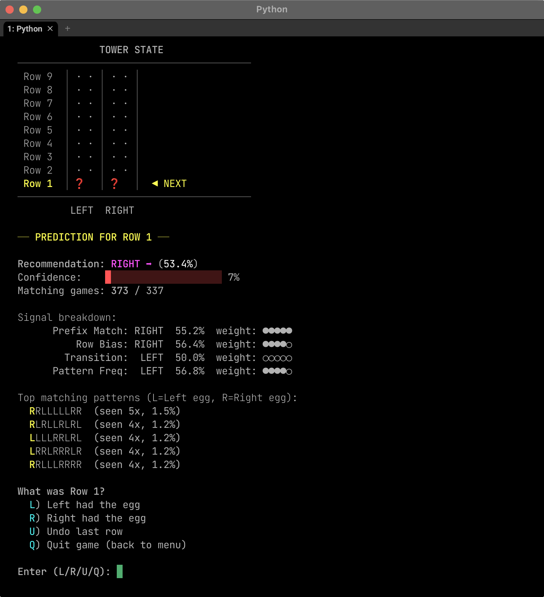
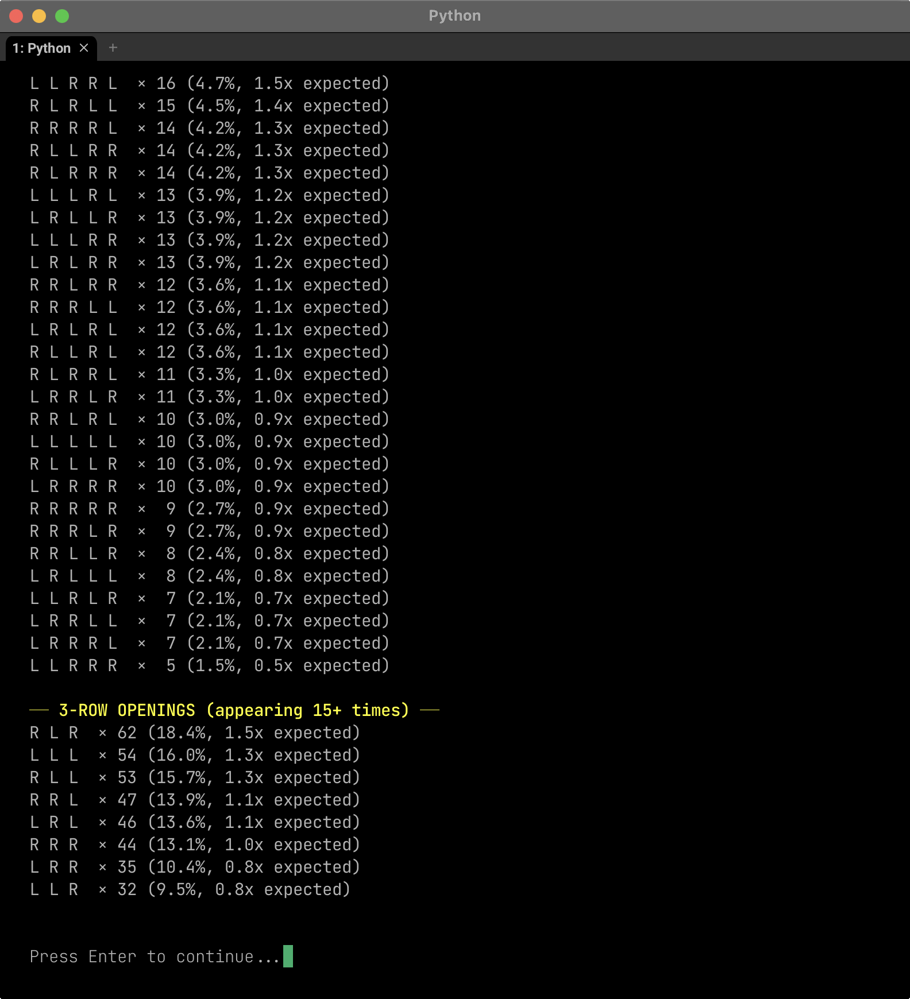
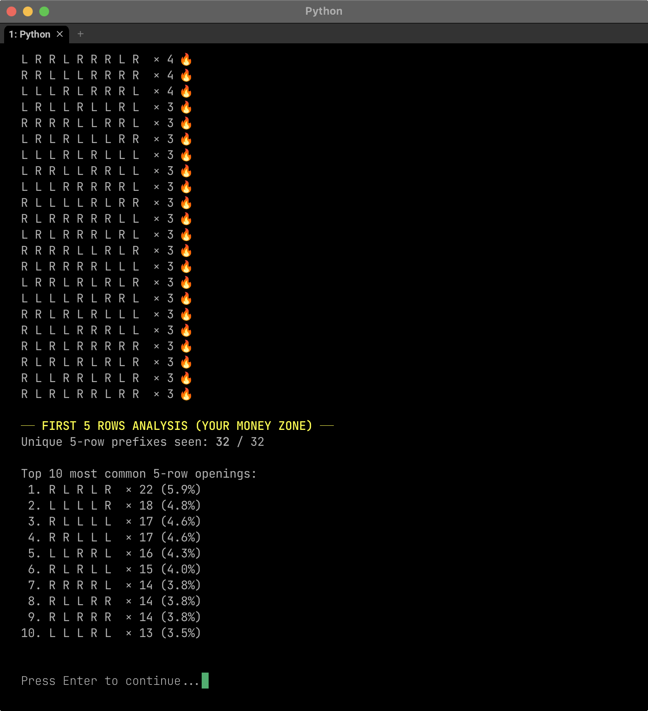
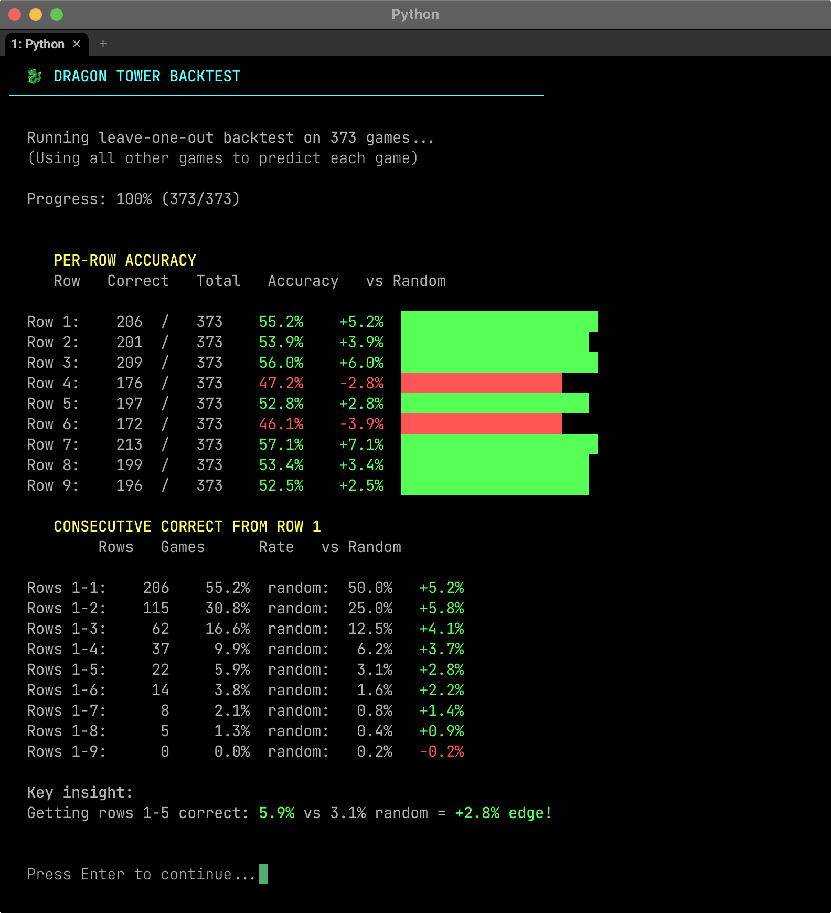

# 🐉 Dragon Tower AI Predictor

A terminal-based AI prediction tool for the **Dragon Tower** game on Stake (Hard mode). It analyzes historical game data stored in CSV logs to predict which column — **Left** or **Right** — hides the egg on each row of the 9-row tower.

---

## How It Works

Dragon Tower (Hard mode) is a 2-column, 9-row grid where one tile per row hides an egg (`1`) and the other is empty (`0`). With 2⁹ = **512 possible patterns**, this tool learns from your logged game history to identify trends and bias probabilities toward the most likely outcome.

The AI uses a **multi-signal fusion** engine combining:

| Signal | Description |
|---|---|
| **Prefix Match** | Finds historical games sharing the same row sequence revealed so far |
| **Row Bias** | Per-row Left/Right frequency across all games |
| **Transition Probability** | How likely the egg switches sides between consecutive rows |
| **Pattern Frequency** | Weighs the top historically matching full patterns |

Each signal is weighted and blended into a single recommendation with a confidence score.

---

## Usage

```bash
# Interactive live predictor (main mode)
python3 dragon_tower_ai.py

# Full statistical analysis of your data
python3 dragon_tower_ai.py --analyze

# Backtest AI accuracy against historical data
python3 dragon_tower_ai.py --backtest
```

> **Requirements:** Python 3.x — no external libraries needed.

---

## Features

- 🎮 **Live Game Mode** — Enter results row-by-row as you play; the AI updates predictions in real time
- 📊 **Statistics View** — Row-level bias, transition probabilities, streak analysis, and top patterns
- 🧪 **Backtest Mode** — Leave-one-out accuracy testing across all logged games
- 🔥 **Hot Patterns** — Highlights full 9-row patterns, 5-row openings, and 3-row openings that appear more frequently than expected
- 💾 **Auto-Save** — Option to save completed games back into the combined CSV to grow the dataset
- ↩ **Undo** — Remove the last entered row during a live session

---

## Screenshots

### New Game — Live Prediction
The tower starts empty; the AI immediately recommends a side for Row 1 with a confidence bar and a full signal breakdown.



---

### Statistics View
Detailed per-row bias data showing how often each row has leaned Left or Right across all logged games, along with the most common 5-row openings.



---

### Hot Patterns
Full 9-row patterns appearing 2+ times and the most common 5-row and 3-row opening sequences, with frequency ratios vs. expected random distribution.



---

### Backtest Results
Leave-one-out accuracy test across 373 games — shows per-row accuracy vs. random (50%) and the consecutive-row success rate. The AI achieved a **+2.8% edge** on the first 5 rows vs. pure chance.



---

## Data Format

Games are stored in `dragon_tower_logs/combined.csv` with the following columns:

| Column | Description |
|---|---|
| `GAME` | Game number |
| `ROW` | Row number (1–9, bottom to top) |
| `LeftTile` | `1` if the egg is on the Left, `0` otherwise |
| `RightTile` | `1` if the egg is on the Right, `0` otherwise |

Individual per-game CSVs are also saved alongside the combined file.

---

## Disclaimer

This tool is for **educational and analytical purposes only**. This is not a get rich quick tool. In the long run you will always get rinsed no matter what.
